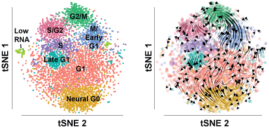

## [Neural G0:  a quiescent-like state found in neuroepithelial-derived cells and glioma](https://www.biorxiv.org/content/10.1101/446344v3)



### Table of Contents
- **[Abstract](#abstract)**
- **[Data and code availability](#data-and-code-availability)**
- **[Instructions to setup data and code for recreating analyses](#instructions-to-setup-data-and-code-for-recreating-analyses)**
    - **[Directory structure](#directory-structure)**
- **[Docker container](#docker-container)**
- **[Aanalyses](#Analyses)**
    1. **[Identification of cell cycle phases](#1-identification-of-cell-cycle-phases)**
    2. **[Resolving the flow of cells through the cell cycle using RNA velocity](2-resolving-the-flow-of-cells-through-the-cell-cycle-using-rna-velocity)**
    3. **[Pepare data for building classifier](#3-pepare-data-for-building-classifier)**
    4. **[Build classifier: 100-fold cross-validation](#4-build-classifier-100-fold-cross-validation)**
    5. **[Sensitivity analysis](#5-sensitivity-analysis)**
    6. **[Whitfield et al., 2002 gold-standard classification](#6-whitfield-et-al-2002-gold-standard-classification)**
    7. **[Classify human scRNA-seq datasets](#7-classify-human-scRNA-seq-datasets)**
    8. **[Classify mouse scRNA-seq datasets](#8-classify-mouse-scRNA-seq-datasets)**
    9. **[Classify glioma scRNA-seq datasets](#9-classify-glioma-scRNA-seq-datasets)**
- **[Contact](#contact)**
- **[Citation](#citation)**

### Abstract
In depth knowledge of the cellular states associated with normal and disease tissue homeostasis is critical for understanding disease etiology and uncovering therapeutic opportunities. Here, we used single cell RNA-seq to survey the cellular states of neuroepithelial-derived cells in cortical and neurogenic regions of developing and adult mammalian brain to compare with 38,474 cells obtained from 59 human gliomas, as well as pluripotent ESCs, endothelial cells, CD45+ immune cells, and non-CNS cancers. This analysis suggests that a significant portion of neuroepithelial-derived stem and progenitor cells and glioma cells that are not in G2/M or S phase exist in two states: G1 or Neural G0, defined by expression of certain neuro-developmental genes. In gliomas, higher overall Neural G0 gene expression is significantly associated with less aggressive gliomas, IDH1 mutation, and extended patient survival, while also anti-correlated with cell cycle gene expression. Knockout of genes associated with the Hippo/Yap and p53 pathways diminished Neural G0 in vitro, resulting in faster G1 transit, down regulation of quiescence-associated markers, and loss of Neural G0 gene expression. Thus, Neural G0 is a dynamic cellular state required for indolent cell cycles in neural-specified stem and progenitors poised for cell division. As a result, Neural G0 occupancy may be an important determinant of glioma tumor progression.

### Data and code availability
- All datafiles need to run this code can be found on [figshare](https://figshare.com/projects/Neural_G0_a_quiescent-like_state_found_in_neuroepithelial-derived_cells_and_glioma/86939).
- The analysis software and scripts are available on [github](https://github.com/plaisier-lab/U5_hNSC_Neural_G0/).

### Instructions to setup data and code for recreating analyses
In order to run the software and scripts you will need to setup a specific directory structure and download all the data and scripts. Here are the instructions to setup things up:
1. Clone the [U5_hNSC_Neural_G0 repository](https://github.com/plaisier-lab/U5_hNSC_Neural_G0/)
```shell
git clone https://github.com/plaisier-lab/U5_hNSC_Neural_G0.git
```
2. Make a "data" folder inside the U5_hNSC_Neural_G0 folder
```shell
cd U5_hNSC_Neural_G0
mkdir data
```
3. Download (and unzip for zip files) all files from [figshare](https://figshare.com/projects/Neural_G0_a_quiescent-like_state_found_in_neuroepithelial-derived_cells_and_glioma/86939):
    - [U5_hNSC.zip](https://figshare.com/articles/dataset/U5_hNSC_zip/12751082) (needs to be unzipped) - contains all the U5 hNSC scRNA-seq datasets as output from cellranger.
    - [ccAF_1536_smaller.pkl](https://figshare.com/articles/software/ccAF_1536_smaller_pkl/12751058) (does not need to be unzipped) - the ccAF ACTINN loadings for classification of cell cycle phases for cells or transcriptome profiles.
    - [geneConversions.zip](https://figshare.com/articles/dataset/geneConversions_zip/12751073) (needs to be unzipped) - helpful gene ID conversion files.
    - [forClassification.zip](https://figshare.com/articles/dataset/forClassification_zip/12751079) (needs to be unzipped) - loom data files that were classified using ccAF.
    - [ssGSEA.GBM.classification.zip](https://figshare.com/articles/dataset/ssGSEA_GBM_classification_zip/12751076) (needs to be unzipped) - subtype classification results for all glioma datasets.
    - [cellcycle_int_integrated.loom](https://figshare.com/articles/dataset/cellcycle_int_integrated_loom/12751055) (does not need to be unzipped) - U5 hNSC data as a loom file that was used to build the ccAF classifier.
```shell
wget https://figshare.com/articles/dataset/U5_hNSC_zip/12751082
wget https://figshare.com/articles/software/ccAF_1536_smaller_pkl/12751058
wget https://figshare.com/articles/dataset/geneConversions_zip/12751073
wget https://figshare.com/articles/dataset/forClassification_zip/12751079
wget https://figshare.com/articles/dataset/ssGSEA_GBM_classification_zip/12751076
wget https://figshare.com/articles/dataset/cellcycle_int_integrated_loom/12751055
unzip U5_hNSC.zip geneConversions.zip forClassification.zip ssGSEA.GBM.classification.zip
```

#### Directory structure
After downloading and unzipping the files the directory structure should look like this:

```
.
+-- U5_hNSC_Neural_G0
|   +-- actinn.py
|   +-- calculatingErrors.py
|   +-- calculatingErrors_CV.py
|   +-- calculatingErrors_Whitfield.py
|   +-- classifiersV3.py
|   +-- classifyPrimaryCells_gliomas.py
|   +-- classifyPrimaryCells_homoSapeins.py
|   +-- classifyPrimaryCells_musMusculus.py
|   +-- converting_to_loom.R
|   +-- cvClassification_FullAnalysis.py
|   +-- data
|   |   +-- ccAF_1536_smaller.pkl
|   |   +-- cellcycle_int_integrated.loom
|   |   +-- forClassification
|   |   |   +-- gliomas
|   |   |   |   +-- Bhaduri.loom
|   |   |   |   +-- GSE102130.loom
|   |   |   |   +-- GSE131928_10X.loom
|   |   |   |   +-- GSE131928_Smartseq2.loom
|   |   |   |   +-- GSE139448.loom
|   |   |   |   +-- GSE70630.loom
|   |   |   |   +-- GSE84465.loom
|   |   |   |   +-- GSE84465_all.loom
|   |   |   |   +-- GSE89567.loom
|   |   |   +-- GSE103322.loom
|   |   |   +-- GSE67833.loom
|   |   |   +-- HEK293T.loom
|   |   |   +-- Nowakowski_norm.loom
|   |   |   +-- PRJNA324289.loom
|   |   +-- geneConversions
|   |   |   +-- ensembl_entrez.csv
|   |   |   +-- hgnc_geneSymbols.txt
|   |   |   +-- hgnc_geneSymbols_ensmbl.txt
|   |   |   +-- human_hgnc_mouse_mgi.csv
|   |   |   +-- mart_export.txt
|   |   +-- highlyVarGenes_WT_sgTAOK1_1584.csv
|   |   +-- ssGSEA.GBM.classification
|   |   |   +-- p_result_Bhaduri_2019.gct.txt
|   |   |   +-- p_result_GSE102130.gct.txt
|   |   |   +-- p_result_GSE131928_GSM3828672.gct.txt
|   |   |   +-- p_result_GSE131928_GSM3828673_1.gct.txt
|   |   |   +-- p_result_GSE131928_GSM3828673_2.gct.txt
|   |   |   +-- p_result_GSE139448.gct.txt
|   |   |   +-- p_result_GSE70630.gct.txt
|   |   |   +-- p_result_GSE84465.gct.txt
|   |   |   +-- p_result_GSE89567.gct.txt
|   |   |   +-- res_All_GSE131928.csv
|   |   +-- U5_hNSC
|   |   |   +-- sgTAOK1
|   |   |   |   +-- filtered_gene_bc_matrices
|   |   |   |   |   +-- hg19
|   |   |   |   |   |   +-- barcodes.tsv
|   |   |   |   |   |   +-- genes.tsv
|   |   |   |   |   |   +-- matrix.mtx
|   |   |   +-- WT
|   |   |   |   +-- filtered_gene_bc_matrices
|   |   |   |   |   +-- hg19
|   |   |   |   |   |   +-- barcodes.tsv
|   |   |   |   |   |   +-- genes.tsv
|   |   |   |   |   |   +-- matrix.mtx
|   |   |   +-- WT_CDTplus
|   |   |   |   +-- filtered_gene_bc_matrices
|   |   |   |   |   +-- hg19
|   |   |   |   |   |   +-- barcodes.tsv
|   |   |   |   |   |   +-- genes.tsv
|   |   |   |   |   |   +-- matrix.mtx
|   |   +-- Whitfield
|   |   |   +-- data
|   |   |   |   +-- whitfield_dataPlusScores_6_30_2020_SHAKE.T_1334.csv
|   |   |   |   +-- whitfield_dataPlusScores_6_30_2020_SHAKE_1334.csv
|   |   |   |   +-- whitfield_dataPlusScores_6_30_2020_TN.T_1334.csv
|   |   |   |   +-- whitfield_dataPlusScores_6_30_2020_TN_1334.csv
|   |   |   |   +-- whitfield_dataPlusScores_6_30_2020_TT1.T_1334.csv
|   |   |   |   +-- whitfield_dataPlusScores_6_30_2020_TT1_1334.csv
|   |   |   |   +-- whitfield_dataPlusScores_6_30_2020_TT2.T_1334.csv
|   |   |   |   +-- whitfield_dataPlusScores_6_30_2020_TT2_1334.csv
|   |   |   |   +-- whitfield_dataPlusScores_6_30_2020_TT3.T_1334.csv
|   |   |   |   +-- whitfield_dataPlusScores_6_30_2020_TT3_1334.csv
|   |   |   +-- markergenes_ForPlotting.csv
|   |   |   +-- metaInformation.csv
|   +-- LICENSE
|   +-- makeDatasetsForClassification.R
|   +-- plotNowakowski.py
|   +-- plottingClassifiers.py
|   +-- README.md
|   +-- results
|   +-- sensitivityAnalysis_plot.py
|   +-- sensitivityAnalysis_run.py
|   +-- ssgse.GBM.classification
|   +-- U5_hNSC_scRNA_seq_Analysis.R
|   +-- Whitfield_classification_ACTINN_analysis.py
```

Now make a results directory to hold the output from analysis scripts:
```shell
mkdir results
```

### Docker container
We facilitate the use of our code and data by providing a Docker Hub container [cplaisier/scrna_seq_velocity](https://hub.docker.com/r/cplaisier/scrna_seq_velocity) which has all the dependencies and libraries to run the scripts. To see how the Docker container is configured plaese refer to the [Dockerfile](https://github.com/plaisier-lab/docker_scRNA_seq_velocity/blob/master/Dockerfile). Please [install Docker](https://docs.docker.com/get-docker/) and then from the command line run:
```shell
docker pull cplaisier/scrna_seq_velocity
```
Then run the Docker container using the following command (replace <the directory holding U5_hNSC_Neural_G0> with the directory where you have cloned the U5_hNSC_Neural_G0 repository):
```shell
docker run -it -v '<the directory holding U5_hNSC_Neural_G0>:/files' cplaisier/scrna_seq_velocity
```
This will start the Docker container in interactive mode and will leave you at a command prompt. You will then want to change directory to '/files/U5_hNSC_Neural_G0' (note the name of the container ef02b3a45938 will likely be different for your instance):
```console
root@ef02b3a45938:/tmp/samtools-1.10# cd /files/U5_hNSC_Neural_G0
root@ef02b3a45938:/files/U5_hNSC_Neural_G0# 
```
If you are able to change to the 'U5_hNSC_Neual_G0 directory' you should be ready to move on to the **Analyses** below.

### Analyses
The order of analyses in this study and the details of each analysis are described below:

#### 1. Identification of cell cycle phases
> **NOTE!** This code requires an extra installation step to revert the R package Seurat to V2.3.4. To install Seurat V2.3.4 please run the following command:
> ```console
> root@ef02b3a45938:/files/U5_hNSC_Neural_G0# R
> > source("https://z.umn.edu/archived-seurat")
> ```
> Once this portion of the analysis is completed please close the Docker instance by typing 'exit' into the console until you return to your base operating system. Then restart the Docker instance as described above.

Using scRNA-seq we profiled 5,973 actively dividing U5-hNSCs (Bressan et al, 2017) to identify the single-cell gene expression states corresponding to cell cycle phases with a focus on G0/G1 subpopulations. This will take in the scRNA-seq data from the 'data/U5_hNSC' directory where the 10X cellranger outputs for the U5 hNSCs are stored.
```console
root@ef02b3a45938:/files/U5_hNSC_Neural_G0# Rscript U5_hNSC_scRNA_seq_Analysis.R
```
This script will output:
- tsne_cell_embeddings_Perplexity_26.csv - TSNE embeddings for use in later plots.
- results/eightClusters_WT_sgTAOK1.csv - marker genes that discriminate between U5 hNSC cell cycle clusters.
- results/TSNE_perplexity_26.pdf - TSNE plot for U5 hNSC WT.
- results/cellCycleNetwork.pdf - network that shows how each cell cycle cluster connects to the other clusters.
- Three hypergeometric p-values for overlaps with YAP target genes which are printed out to the console.

#### 2. Resolving the flow of cells through the cell cycle using RNA velocity 
We added directionality to the edges using RNA velocity which computes the ratio of unspliced to spliced transcripts and infers the likely trajectory of cells through a two-dimensional single cell embedding, e.g. tSNE. The RNA velocity trajectories delineate the cell cycle in the expected orientation. First, we use velocyto to realign the transcriptome and tabulate spliced and unspliced transcript counts for each gene (we provide the result of this and not the raw data and genome build from 10X are very large [genome build used from cellranger](https://support.10xgenomics.com/single-cell-gene-expression/software/release-notes/build#hg19_3.0.0)):
```console
root@ef02b3a45938:/files/U5_hNSC_Neural_G0# velocyto run10x -m hg19_rmsk.gtf WT genes.gtf
```
This analysis will output:
 - U5_velocyto.loom - a loom file with the matrix of spliced and unspliced reads for each gene.
 
Then, we use scvelo to take in the unsplied and spliced transcript counts and compute the RNA velocities and stream lines.
```console
root@ef02b3a45938:/files/U5_hNSC_Neural_G0# python3 scvelo_analysis.py
```
This script will output:
- ccAdata_velocity_stream_tsne.png - tSNE embeddings with RNA velocity stream lines.

#### 3. Pepare data for building classifier
We faciliatate further analysis in Python by converting the 
converting_to_loom.R

#### 4. Build classifier: 100-fold cross-validation
cvClassification_FullAnalysis.py
calculatingErrors_CV.py
plottingClassifiers.py

#### 5. Sensitivity analysis
sensitivityAnalysis_run.py
sensitivityAnalysis_plot.py

#### 6. Whitfield et al., 2002 gold-standard classification
Whitfield_classification_ACTINN_analysis.py

#### 7. Classify human scRNA-seq datasets
classifyPrimaryCells_homoSapiens.py
plotNowakowski.py

#### 8. Classify mouse scRNA-seq datasets
classifyPrimaryCells_musMusculus.py

#### 9. Classify glioma scRNA-seq datasets
classifyPrimaryCells_gliomas.py

### Contact
For issues or comments please contact:  [Chris Plaisier](mailto:plaisier@asu.edu)

### Citation
(Neural G0: a quiescent-like state found in neuroepithelial-derived cells and glioma.)[https://doi.org/10.1101/446344] Samantha A. O'Connor, Heather M. Feldman, Chad M. Toledo, Sonali Arora, Pia Hoellerbauer, Philip Corrin, Lucas Carter, Megan Kufeld, Hamid Bolouri, Ryan Basom, Jeffrey Delrow, José L. McFaline-Figueroa, Cole Trapnell, Steven M. Pollard, Anoop Patel, Patrick J. Paddison, Christopher L. Plaisier. bioRxiv 446344; doi: (https://doi.org/10.1101/446344)[https://doi.org/10.1101/446344]
